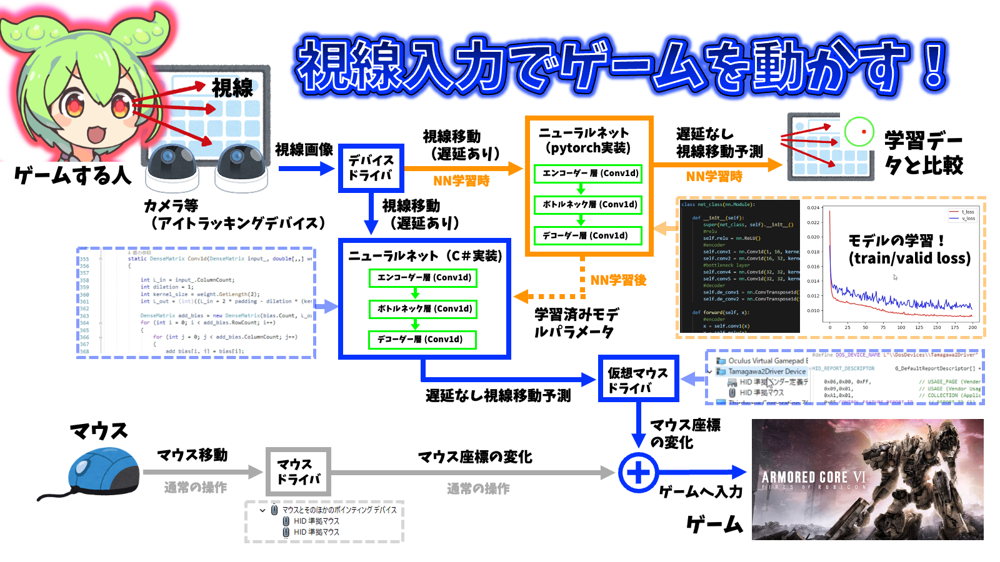

# EyeTrackingAimで使うための仮想マウスを作るためのプログラム

## 使い方
1. releaseからフォルダをダウンロードしてください。
2. 以下のコマンドを順番に実行してください

##### 先ず証明書を作ります。
```bash
"C:\Program Files (x86)\Windows Kits\10\bin\10.0.22000.0\x64\makecert" -r -pe -n "CN=tamagawa2 CA" -ss "tamagawa2Store" tamagawaumdf.cer
```
```bash
certmgr -add  tamagawaumdf.cer -s -r localMachine root
```
```bash
certmgr -add  tamagawaumdf.cer -s -r localMachine root
```
```bash
certmgr -add  tamagawaumdf.cer -s -r localMachine trustedpublisher
```
```bash
certutil -addstore TrustedPublisher tamagawaumdf.cer
```

##### ドライバーをインストールします。
```bash
"C:\Program Files (x86)\Windows Kits\10\bin\10.0.22000.0\x86\inf2cat"  /driver:"ダウンロードしたフォルダのパス\Tamagawa2Driver" /os:10_X64
```
```bash
cd ダウンロードしたフォルダのパス\Tamagawa2Driver
```
```bash
"C:\Program Files (x86)\Windows Kits\10\bin\10.0.22000.0\x86\signtool" sign -fd SHA1 -v -n "tamagawa2 CA" -s tamagawa2Store tamagawaumdf.cat
```
```bash
"C:\Program Files (x86)\Windows Kits\10\Tools\x64\devcon" install Tamagawa2Driver.inf Root\Tamagawa2Driver
```